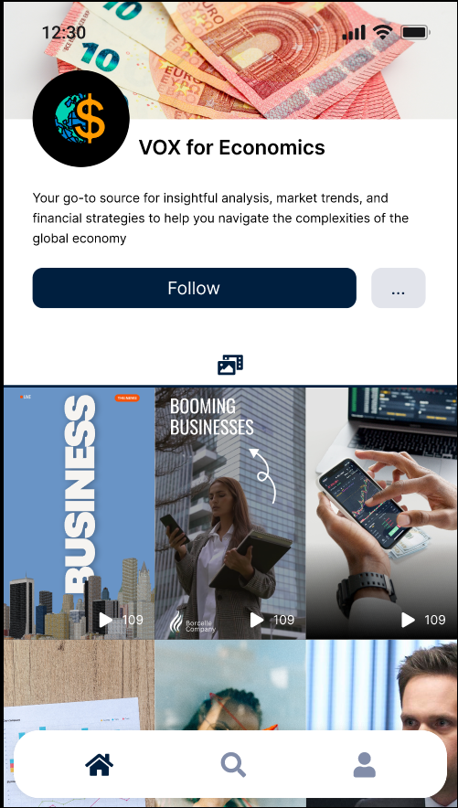

# Brainstorming

**Nazwa:**  VoteWise: Engage, Educate, EmpowerWiseChoice
**Motyw przewodni?** Jakaś starożytna Grecja imperium Rzymskie?Barwy, motyw kolorystyczny - imo bialo czarne(?)

**Features** - opis słowny co user moze od apki oczekiwać, co może na niej robić, jaki ma gain z korzystania jej 

**Rolka z politycznymi zagadnieniami** - przyklad angielskich slowek z apki Andrzeja

- Czym jest demokracja i jak sie narodzila
- Porownanie z innymi ustrojami politycznymi
- Dlaczego komuna jest chujowa
- Opis podstawowych aspektów (jak głosować itd)
- Czym jest neoliberalizm i takie tam

**Chuj wie narazie co:**

Zagłębienie młodych w świat polityki. Jak? Tak samo jak zagłębiają się w świat influencerów itd. Kontakt z ludźmi jest kluczowym aspektem w tym celu. Dlatego przenosząc politykę na social media. Ludzie młodzi chętniej posłuchają ludzi młodych, dlatego do uczestnictwa w platformie zaproszeni zostaną głównie młodzi politycy dobrze zaznajomieni z social media i nowym technologiami. Ludzie młodzi rzadko interesująs się polityką, bo jest dla nich nudna, rozwiązaniem jest wydać ją w modelu bardziej zbliżonym np. do TikToka. Dlugie artykuły obejmujące wiele informacji nikogo nie zainteresują. Preferowane przez młodzież są szybkie, łatwe przyswajalne treści - najlepiej w formie krótkich filmikow.Przedstawienie tematów najbardziej palących/na topie w kraju (polska np. 800+) i ich aktualizacja na bieżąco. Np po podpisaniu ustawy albo jakichś zmianach (tylko to chyba by człowiek musiał robić). Dodatkowo tematy HOT mogły by mieć swoje labelki które są przypisane do każdego polityka z dopiskiem popiera/neutralny/neguje) 
**Typy kont**

- End User
- Polityk
  - wygłaszanie postulatów (jestem za… ekologia etc)
  - Weryfikacja (jak na twitterze)
  - Labelki trending?
  - Przy zakladaniu konta wybiera tagi ktorymi sie kieruje: ekologia, lewica, prawica, etc.
  - Partia
- Info (kanał informacyjny)content informacyjny (tłumaczenie jakiegoś pojęcia/zagadanienia)content nowości w polityce (np. wchodzi jakaś nowa ustawa i co będzie zmieniała w życiu ludzi)

Shared dane userow
Hashtagi (#lewica #prawica #ekologia…)Wiek/Postać tłumacząca zagadnienia z polityki (aka sowka z duolingo)
    Weryfikacja statementow politykow w dluzszym okresie czasuZmniejszanie dystansu do politykow 

**Widoki**
Widok startowy.
Wideo i informacje jak na tiktoku z filtramiPrzejście do kanał politykaProfil polityka
Zakładka co sądze o Np #podatek-cukrowy 
Cos tam cos tamZakładka Profilu polityka Zakladka z wideo politykaTworzenie konta
konfiguracja profilu 

**Problem (zdefiniowany poprzez cel):**Zachęcenie ludzi młodych do wzięcia udziału w wyborach. 

**Rozbicie problemu:**Po pierwsze należy zastanowić się dlaczego odsetek ludzi oddających głos wśród osób młodych jest niższy niż osób w wieku 40-60. Dwa główne aspekty to:

-P1. Młodzi ludzie muszą sprostać szeregowi wyzwań wchodząc w dorosłe życie, po pierwsze zdobyć wykształcenie, osiedlić się, założyć rodzinę, wychować potomstwo, z każdym kolejnym wyzwaniem rośnie ich świadomość, że decyzje władz rzutują na ich życie. Dopiero z wiekiem to się zauważa.

P2. Drugim, ważniejszym czynnikiem jest zasobów niezbędnych do pełnego i świadomego uczestnictwa. Kluczowe jest obeznanie w takich tematach jak polityka, gospodarka i społeczeństwo. 

P3. To jest bariera wejściowa, aby móc poznać i ocenić poglądy konkretnych polityków. I to właśnie dopiero znajomość kandydatów, ich poglądów oraz programów partii pozwala podejść młodemu człowiekowi świadomie do wyborów.

Są to dwa problemy które nazwiemy odpowiednio P1 i P2. Podkreślając, że problem P2 jest istotniejszym. Jak teraz rozwiązać te problemy?

P1 - Tutaj należy przyspieszyć poziom zdobywania przez nich świadomości. To czego normalnie uczy ich życie może zostać zbudowane nieco sztucznie. Nasuwa się od razu pomysł, aby edukować ludzi w tym zakresie.

P2 - Rozwiązanie jest proste. Znowu potrzebna jest edukacja.

P3 - Tu potrzebny jest odpowiednie medium do przenoszenia informacji pomiędzy politykami, a młodymi wyborcami.
Czyli generalnie sprowadza się to platformy, które jest medium informacyjnym w trzech kategoriach.
Pytanie teraz jak zaadjustować taką platformę dla ludzi młodych? Zachęcić ich do korzystania oraz utrzymać ich przy niej. Co konkretnie sprawi, że młodzi ludzie będą z niej korzystać?
**Charakterystyka ludzi młodych:**

C1 - Diverse interests and beliefs. Everyone wants to be unique in some way, seeks for own identity, own set of political values. 

C2 - Digital Natives. Prefer digital content (videos, podcasts), in contrast to real meetings. 

C3 - Short attention spans. Content should be concise, engaging and at the point. Content which involves long reading is likely to disengage.

C4 - Eager to build social bond

Ze związku na:C1 - Wyborca powinien mieć szerokie spektrum wyboru. Wśród kandydatów powinien znaleźć coś dla siebie. Mieć przegląd różnorodnych kandydatów.

C2 - C3 Forma przekazu powinna być krótka i catchy jak np. Krótkie filmy video.

C4 - Wyborca ma mieć możliwość dobrze poznać kandydata i zbudować z nim pewnego rodzaju więź. Po prostu po ludzku go “polubić”.

**Propozycja:**Platforma na której użytkownikom końcowym prezentowane by było krótkie filmiki video. Filmiki można podzielić na dwie kategorie:Filmy tworzone przez polityków. Mające na celu informowanie o swoich poglądach oraz budowanie więzi z wyborcą. P3Filmy tworzone przez platformę. Mające na celu edukacje w zakresie polityki, gospodarki, społeczeństwa P2 oraz filmiki budujące świadomość of importance of voting P1.Filmiki dynamicznie pojawiły by się w tak zwanym main feed użytkownika końcowego. Oprócz tego user ma możliwość przejrzenia profilu pojedynczego polityka. A znajdzie na nim:Komentarze dotyczące treniding issues t.j. Podatek-cukrowy, Płaca minimalna. Pozwala to szybko poznać poglądy polityka. F1. Wyniki w skali 8 values. Pozwala to szybko poznać poglądy polityka.Filmy video, które zamieścił polityk. Platforma posiadałaby również rozbudowany system tagów, który pozwalałby użytkownikowi eksplorować dany, interesujący go temat. Obejrzeć filmiki polityków, czy przeczytać ich komentarze dotyczące danego zagadnienia identyfikowanego tagiem.
Filmiki obu rodzajów byłyby przemieszane ze sobą, a użytkownik ma możliwość obserwowania kanałów, (którymi może być albo polityk albo kanał tematyczny).
**Kanały tematyczne**Mające na celu edukację, tak aby user po obejrzeniu kontentu czuł się bardziej świadomy swojego potencjalnego wyboru. Tematy filmików to mogły by być:Czym jest demokracjaMonarchia vs RepublikaTop 3 cases when communism failedTop 5 najstarszych konstytucji w EuropieFilmiki mają zachęcić usera od różnych stron, stąd też tak szeroka tematyka. Rynek jest otwarty, albo platforma sama by tworzyła kontent, albo otworzyłby się rynek dla twórców kontentu edukacyjnego, co się zamyka do jednego, bo reklam by nie było, więc platforma by im płaciła. Za edukację trzeba zapłacić, i jest to edukacja polaków/europejczyków, więc zapłacą rządy tych ludzi.

# App screenshots

